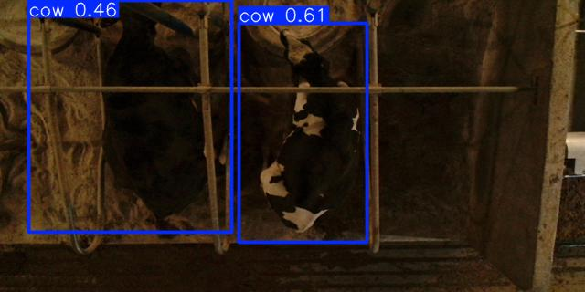

# Analysis of Cow Behavior in Resting Areas Using Aerial Images

## Project Overview

This project aims to analyze the behavior of dairy cows in their resting areas through aerial images. We utilize data mining to find patterns and significant insights regarding the use of sand beds, such as how much time cows spend resting, how often they prefer certain spaces, and the postures they adopt in the beds.

## Project Objectives

### Business Objectives
- **Resting Space Optimization**:Optimize the usage of resting spaces for cows, identifying which areas are being occupied the most.
- **Facilitate decision-making**:  Provide actionable insights to improve decision-making related to the management of resting areas, ensuring more efficient use of space and better animal welfare.

### Key Questions:
1. How many cows are resting in the beds?
2. How long do they stay in the beds?
3. Which beds are used more frequently than others?
4. How are the cows distributed when resting (standing or lying down)?

### Data Mining Objectives
- **Develop a Cow Detection and Classification Model**: Build a model to detect and classify cows based on their posture (standing/lying) across different areas of the ranch.
- **Quantify and Characterize Cattle Population**: Measure and analyze the cattle population by posture in various resting zones to gather insights on herd behavior and space usage.

## Methodology

This project follows the CRISP-DM methodology (Cross-Industry Standard Process for Data Mining), covering the following phases:

1. **Business Understanding**: Define business objectives, focusing on optimizing cow rest time and improving the management of resting spaces by identifying occupied and empty beds, as well as the cows' postures (standing or lying down).
2. **Data Understanding**: Collect aerial images from the ranch to understand their structure and content. This includes evaluating the quality of the images and the variability of cow postures across different beds and ranch areas.
3. **Data Preparation**: Label and classify the collected images manually. Each bed is annotated based on the presence of a cow and its posture (standing or lying). This step also involves ensuring the dataset is clean and consistent for model training.
4. **Modeling**: Develop an image classification model using Convolutional Neural Networks (CNNs) to detect cow presence and classify their posture (standing or lying) in each bed. The model aims to quantify cow occupancy in the resting zones of the ranch.
5. **Evaluation**: Assess the model's performance using relevant metrics such as accuracy, precision, recall, and F1-score. Fine-tune the model and parameters to improve classification accuracy, especially for beds with unclear or partial occupancy.
6. **Deployment**: Generate reports that summarize the analysis of cow bed usage, providing insights into which areas are most occupied and how the herd's posture is distributed across the ranch. This information supports decision-making on optimizing resting space management.

## Detections

Check out some real detections of the model down below!





## Repository Structure

```bash
|-- database/
|   |-- db_utils.py              # Utility functions for interacting with the database.
|   |-- db_init.py               # Initialization scripts for setting up database tables and connections.
|-- dataset/
|   |-- bounding/                # Contains images and annotation files for the bounding box model (e.g., image coordinates).
|   |-- classifier/              # Contains the dataset for the classification model, including original, split, and transformed images.
|   |-- sand/                    # Dataset containing sand-related images, used for model training or additional context (if relevant).
|-- documentation/
|   |-- business/                # Documentation detailing the business understanding and objectives of the project.
|   |-- data/                    # Documentation on data understanding, dataset structure, and preparation process.
|   |-- modeling/                # Documentation on model architecture, training strategies, and algorithms used.
|   |-- evaluation/              # Documentation on model evaluation, performance metrics, and fine-tuning.
|   |-- deployment/              # Documentation related to model deployment, integration, and reporting.
|-- logs/
|   |-- execution_logs.txt       # Log files for tracking execution details and errors.
|-- models/
|   |-- bounding/                # Contains the trained models for the object detection task (YOLO models).
|   |-- classifier/              # Contains the trained models for the classification task (CNN models).
|-- results/                     # Contains the results and evaluation metrics for the object detection and classification models.
|-- source/
|   |-- bounding/                # Contains scripts for the object detection models (e.g., YOLO).
|   |-- classifier/              # Contains scripts for the classification models (e.g., CNN).
|   |-- data_preparation/        # Contains scripts and notebooks for data preprocessing and transformation.
|   |-- sand/                    # Contains experimental scripts or additional data processing code.
|   |-- main.py                  # Main script to run the pipeline and generate results.
|   |-- model_utils.py           # Utility functions for working with models (e.g., loading, saving models).
|-- requirements.txt             # Lists the required Python packages for the project
|-- README.md                    # Project description (this file).
